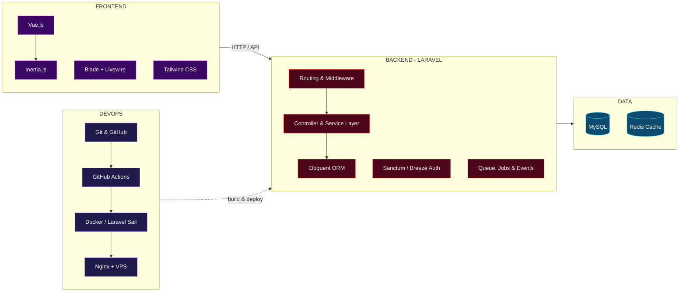

<!-- ============================== HEADER ============================== -->
<p align="center">
  
</p>

<p align="center">
  <a href="https://github.com/Bahtiarrifaistudent">
    
  </a>
</p>

<p align="center">
  
  
  
</p>

<p align="center">
  <a href="https://github.com/Bahtiarrifaistudent"></a>
  <a href="https://linkedin.com/in/bahtiarrifai3"></a>
  <a href="mailto:bachtiarrifai55@gmail.com"></a>
</p>


## `$ php artisan about`

```yaml
name      : Bahtiar Rifai
campus    : Politeknik Negeri Indramayu
role      : Fullstack Developer (Backend-oriented)
main      : Laravel + Vue.js
mission   : "Membangun aplikasi web yang rapi di belakang layar, nyaman di depan layar."
focus     :
  - REST API & arsitektur backend Laravel yang bersih dan scalable
  - Frontend reaktif dengan Vue.js + Inertia.js
  - Desain database relasional & optimasi query Eloquent
  - Deployment dan workflow DevOps yang sederhana tapi andal
contact   : bachtiarrifai55@gmail.com
motto     : "Code it clean. Ship it right."
```

## How I Build a Web App



## Tech Stack

<table>
  <tr>
    <th align="center" width="33%">FRONTEND</th>
    <th align="center" width="34%">BACKEND</th>
    <th align="center" width="33%">DEVOPS</th>
  </tr>
  <tr>
    <td align="center" valign="top">
      
      <br/><br/>
      <sub>Vue.js sebagai minat utama di sisi frontend, dipadukan dengan Inertia.js agar terhubung mulus ke Laravel.</sub>
    </td>
    <td align="center" valign="top">
      
      <br/><br/>
      <sub>Laravel adalah rumah saya: API, autentikasi, queue, hingga struktur kode yang maintainable.</sub>
    </td>
    <td align="center" valign="top">
      
      <br/><br/>
      <sub>Versioning, CI/CD sederhana, containerization, sampai aplikasi online di server.</sub>
    </td>
  </tr>
</table>

## Laravel Ecosystem I've Explored

<p align="center"><b>Starter Kit & Full-stack Glue</b></p>
<p align="center">
  
  
  
  
  
</p>

<p align="center"><b>Auth & Security</b></p>
<p align="center">
  
  
  
</p>

<p align="center"><b>Data, Report & Utility</b></p>
<p align="center">
  
  
  
  
</p>

<p align="center"><b>Dev Tools & Testing</b></p>
<p align="center">
  
  
  
  
  
</p>

## Featured Projects

<p align="center">
  <a href="https://github.com/Bahtiarrifaistudent/Floral-Innovators">
    
  </a>
  <a href="https://github.com/Bahtiarrifaistudent/smartcity-indramayu">
    
  </a>
</p>

## Roadmap 2026

```diff
+ [x] Menguasai dasar Laravel: routing, Eloquent, Blade, migration
+ [x] Membangun aplikasi CRUD dengan autentikasi & role permission
+ [x] Mencoba berbagai library ekosistem Laravel
! [ ] Membangun SPA dengan Laravel + Inertia.js + Vue.js
! [ ] REST API yang terdokumentasi dan teruji (Pest)
! [ ] Deployment otomatis dengan Docker & GitHub Actions
- [ ] Laravel Certified Developer ... coming soon
```

## GitHub Stats

<p align="center">
  
  
</p>

<p align="center">
  
</p>

<p align="center">
  
</p>

<details>
<summary><b>Tips jaga streak: WIB vs UTC (klik untuk buka)</b></summary>
<br/>

GitHub mencatat kontribusi dalam **UTC**, sedangkan kita hidup di **WIB (UTC+7)**.

| Commit di WIB | Tercatat GitHub (UTC) |
| --- | --- |
| 10 Mei, 00:00 - 06:59 | 9 Mei (masih hari kemarin) |
| 10 Mei, 07:00 - 23:59 | 10 Mei |

> Mau streak aman? Commit setelah **jam 07.00 WIB**.
</details>

<!-- ======================= OPSIONAL: hapus blok <details> ini jika tidak diperlukan ======================= -->
<details>
<summary><b>Eksplorasi Lain (opsional): Cyber Security & AI</b></summary>
<br/>

Di luar web development, saya juga pernah bereksperimen di bidang keamanan siber dan kecerdasan buatan.

<p align="center">
  <a href="https://github.com/Bahtiarrifaistudent/Simulasi-Brute-Force-attack">
    
  </a>
  <a href="https://github.com/Bahtiarrifaistudent/Penanganan-Brute-Force-Attack">
    
  </a>
  <a href="https://github.com/Bahtiarrifaistudent/Asisten-20berbasis-20NLP-20Polindra">
    
  </a>
  <a href="https://github.com/Bahtiarrifaistudent/ricescanai">
    
  </a>
</p>

<p align="center">
  
  <br/>
  
  
  
  
</p>
</details>
<!-- ======================= akhir blok opsional ======================= -->

## Contribution Snake

<p align="center">
  <picture>
    <source media="(prefers-color-scheme: dark)" srcset="https://raw.githubusercontent.com/Bahtiarrifaistudent/Bahtiarrifaistudent/output/github-snake-dark.svg"/>
    <source media="(prefers-color-scheme: light)" srcset="https://raw.githubusercontent.com/Bahtiarrifaistudent/Bahtiarrifaistudent/output/github-snake.svg"/>
    
  </picture>
</p>

---

<table align="center">
  <tr>
    <td align="center">
      <i>"Frontend yang indah membuat orang datang,<br/>backend yang kokoh membuat mereka bertahan."</i>
      <br/><br/>
      <b>- Bahtiar Rifai</b>
    </td>
  </tr>
</table>

<p align="center">
  
</p>


