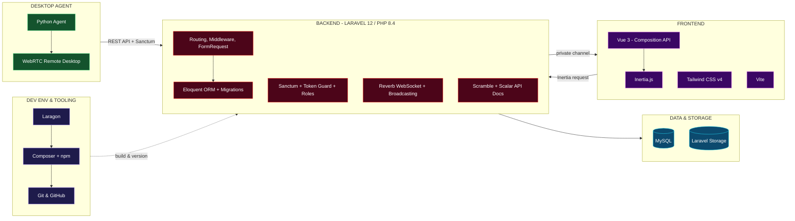

<!-- ============================== HEADER ============================== -->
<p align="center">
  
</p>

<p align="center">
  <a href="https://github.com/Bahtiarrifaistudent">
    
  </a>
</p>

<p align="center">
  
  
  
</p>

<p align="center">
  <a href="https://github.com/Bahtiarrifaistudent"></a>
  <a href="https://linkedin.com/in/bahtiarrifai3"></a>
  <a href="mailto:bachtiarrifai55@gmail.com"></a>
</p>


## `$ php artisan about`

```yaml
name      : Bahtiar Rifai
campus    : Politeknik Negeri Indramayu
role      : Fullstack Developer (Backend-oriented)
main      : Laravel 12 + Inertia.js + Vue 3
mission   : "Membangun aplikasi web yang rapi di belakang layar, nyaman di depan layar."
focus     :
  - Arsitektur backend Laravel: API, autentikasi, realtime broadcasting
  - SPA modern dengan Inertia.js + Vue 3 Composition API
  - Desain database relasional & Eloquent ORM
  - Dokumentasi API otomatis (OpenAPI)
contact   : bachtiarrifai55@gmail.com
motto     : "Code it clean. Ship it right."
```

## How I Build a Web App

<sub>Gambaran arsitektur dari project terbesar saya: <b>Monitoring App</b>, sistem monitoring perangkat realtime berbasis Laravel + Vue.</sub>



## Tech Stack

<table>
  <tr>
    <th align="center" width="33%">FRONTEND</th>
    <th align="center" width="34%">BACKEND</th>
    <th align="center" width="33%">DEVOPS & TOOLING</th>
  </tr>
  <tr>
    <td align="center" valign="top">
      
      <br/><br/>
      <sub>Vue 3 dengan <code>&lt;script setup&gt;</code>, <code>useForm</code> & <code>usePage</code>, terhubung ke Laravel lewat Inertia.js.</sub>
    </td>
    <td align="center" valign="top">
      
      <br/><br/>
      <sub>Laravel 12 di atas PHP 8.4: Eloquent, Blade, validasi, autentikasi API, hingga WebSocket.</sub>
    </td>
    <td align="center" valign="top">
      
      <br/>
      
      
      
      <br/><br/>
      <sub>Lingkungan lokal Laragon, dependency lewat Composer & npm, versioning dengan Git branch.</sub>
    </td>
  </tr>
</table>

## Laravel Ecosystem I've Used

<p align="center"><b>Full-stack Glue</b></p>
<p align="center">
  
  
  
</p>

<p align="center"><b>Auth & Access Control</b></p>
<p align="center">
  
  
  
</p>

<p align="center"><b>Realtime & Communication</b></p>
<p align="center">
  
  
  
</p>

<p align="center"><b>API Documentation</b></p>
<p align="center">
  
  
  
</p>

<p align="center"><b>Media & File</b></p>
<p align="center">
  
  
  
</p>

## Project Highlight: Monitoring App

<table>
  <tr>
    <td>
      <b>Sistem monitoring perangkat realtime</b> berbasis Laravel 12 + Inertia + Vue 3, dengan desktop agent Python yang berkomunikasi lewat REST API.
      <br/><br/>
      <b>Yang saya bangun di dalamnya:</b>
      <ul>
        <li>REST API untuk agent dengan autentikasi <b>Laravel Sanctum</b>, plus token guard terpisah untuk API admin</li>
        <li>Update status realtime lewat <b>Laravel Reverb</b> (private channel per device) dengan fallback HTTP polling</li>
        <li><b>Remote desktop</b> melalui WebRTC signaling (offer / answer / ICE)</li>
        <li><b>Geofencing</b> dengan algoritma ray-casting buatan sendiri untuk deteksi masuk/keluar zona</li>
        <li><b>Policy engine</b> per device/group: screenshot, URL/USB/download filter, kontrol WiFi, hotspot & Bluetooth</li>
        <li>Konversi screenshot ke <b>WebP</b> dengan GD Library, report CSV & Excel per tab</li>
        <li>Dokumentasi API otomatis dengan <b>Scramble + Scalar</b></li>
      </ul>
      <sub><b>Agent:</b> Python, Tkinter, pywin32, psutil, mss, Pillow, requests</sub>
    </td>
  </tr>
</table>

## Roadmap 2026

```diff
+ [x] Membangun aplikasi Laravel 12 + Inertia.js + Vue 3
+ [x] REST API dengan Sanctum & dokumentasi OpenAPI otomatis
+ [x] Fitur realtime dengan Laravel Reverb & Broadcasting
+ [x] Integrasi WebRTC untuk remote desktop
! [ ] Automated testing untuk API (Pest / PHPUnit)
! [ ] Containerization dengan Docker
! [ ] CI/CD & deployment otomatis ke server
```

## Other Experience

<sub>Di luar web development, saya juga pernah mengerjakan project di bidang keamanan siber, AI, dan smart city.</sub>

<table>
  <tr>
    <th align="center" width="33%">CYBER SECURITY</th>
    <th align="center" width="34%">AI & DATA</th>
    <th align="center" width="33%">WEB PROJECTS</th>
  </tr>
  <tr>
    <td valign="top">
      <sub>
        <b><a href="https://github.com/Bahtiarrifaistudent/Simulasi-Brute-Force-attack">Simulasi Brute Force Attack</a></b><br/>
        Simulasi serangan brute force dengan Python.<br/><br/>
        <b><a href="https://github.com/Bahtiarrifaistudent/Penanganan-Brute-Force-Attack">Penanganan Brute Force Attack</a></b><br/>
        Implementasi teknik mitigasinya.
      </sub>
    </td>
    <td valign="top">
      <sub>
        <b><a href="https://github.com/Bahtiarrifaistudent/Asisten-20berbasis-20NLP-20Polindra">Asisten berbasis NLP Polindra</a></b><br/>
        Asisten virtual kampus berbasis Natural Language Processing (Jupyter Notebook).<br/><br/>
        <b><a href="https://github.com/Bahtiarrifaistudent/ricescanai">RiceScanAI</a></b><br/>
        Eksplorasi AI untuk tanaman padi.
      </sub>
    </td>
    <td valign="top">
      <sub>
        <b><a href="https://github.com/Bahtiarrifaistudent/smartcity-indramayu">Smart City Indramayu</a></b><br/>
        Prototype platform smart governance, waste management & layanan publik.<br/><br/>
        <b><a href="https://github.com/Bahtiarrifaistudent/Floral-Innovators">Floral Innovators</a></b><br/>
        Aplikasi web berbasis Laravel Blade.
      </sub>
    </td>
  </tr>
  <tr>
    <td align="center"></td>
    <td align="center"> </td>
    <td align="center"></td>
  </tr>
</table>

## GitHub Stats

<p align="center">
  
  
</p>

<p align="center">
  
</p>

<p align="center">
  
</p>

<details>
<summary><b>Tips jaga streak: WIB vs UTC (klik untuk buka)</b></summary>
<br/>

GitHub mencatat kontribusi dalam **UTC**, sedangkan kita hidup di **WIB (UTC+7)**.

| Commit di WIB | Tercatat GitHub (UTC) |
| --- | --- |
| 10 Mei, 00:00 - 06:59 | 9 Mei (masih hari kemarin) |
| 10 Mei, 07:00 - 23:59 | 10 Mei |

> Mau streak aman? Commit setelah **jam 07.00 WIB**.
</details>

## Contribution Snake

<p align="center">
  <picture>
    <source media="(prefers-color-scheme: dark)" srcset="https://raw.githubusercontent.com/Bahtiarrifaistudent/Bahtiarrifaistudent/output/github-snake-dark.svg"/>
    <source media="(prefers-color-scheme: light)" srcset="https://raw.githubusercontent.com/Bahtiarrifaistudent/Bahtiarrifaistudent/output/github-snake.svg"/>
    
  </picture>
</p>

---

<table align="center">
  <tr>
    <td align="center">
      <i>"Frontend yang indah membuat orang datang,<br/>backend yang kokoh membuat mereka bertahan."</i>
      <br/><br/>
      <b>- Bahtiar Rifai</b>
    </td>
  </tr>
</table>

<p align="center">
  
</p>


